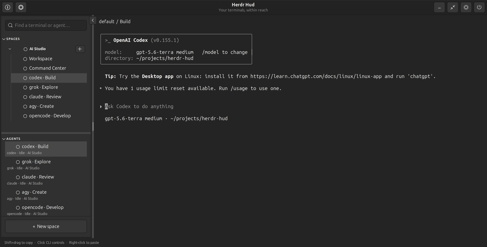

# Herdr Hud for Ubuntu

A native GTK/VTE companion for local Herdr terminals and agents on Ubuntu 26.04.

**A remix of Alex Finn’s version by [Alex Jax](https://github.com/alex-jax).**
Original: [Herdr HUD for Omarchy](https://github.com/finna/omarchy-herdr-hud).
This is an independently maintained Ubuntu implementation.

## Install

**[Step-by-step installation → install.md](install.md)** ·
**[Download the .deb](https://github.com/alex-jax/jax-herdr-hud/releases)**

**Quick setup:** Download the `.deb` → install Herdr → install Hud → start
`herdr` once → **log out and back in** → open Hud → **gear → Enable floating H**.

Targets Ubuntu 26.04 / GNOME 50; tested on amd64 with Herdr 0.9.1.
The native `.deb` installs the app and optional floating H extension, and APT
resolves its system Python/GTK/VTE dependencies. Herdr and CLI agents are separate
installations. Source installation and modification instructions are also included.

**1.1.0 brings full-window themes and improved space closing.**
See the [release notes](CHANGELOG.md) and
[validation record](docs/VALIDATION.md). Distribution is through GitHub;
there is no Snap Store or App Center release.

Features include collapsible spaces with compact terminal rows, agent shortcuts,
live status and notifications, search, clickable CLI controls, Shift+drag to copy,
right-click paste, light/dark display and a draggable floating H.

## Screenshots

Herdr Hud 1.0.0 with two shell terminals and Codex, Grok, Claude Code,
Antigravity and OpenCode running in the AI Studio space.

**Dark theme** — compact spaces, terminal rows and agent shortcuts.



**Light theme** — the same workspace in light mode.


## Floating H


**H is your draggable desktop shortcut to Hud.** Click it to show or hide the
window; drag it wherever you like. The blue dot means there is unread agent
activity. Its outline follows your desktop accent colour. Enable it from
**Settings → Enable floating H** after the installation logout/login step.

## Use

Hud opens the default space and terminal automatically and reuses existing
sessions. On first discovery, the default `~` space becomes `Space 1`; custom
names are preserved. New space adds one workspace and one terminal.

Terminals appear in compact, indented rows beneath each space in the sidebar.
Use **+** beside a space to add one. Agent terminals stay under their space, with
shortcuts in **Agents** to the same sessions. Search shows matching terminals or
agents, including matches inside collapsed spaces. Each space collapses separately.
Green dots mean working, yellow means unread activity, and hollow means read and
idle. Closing the last terminal or agent removes its secondary space. The first
space keeps its last terminal; closing other agent terminals asks for confirmation.
Attach real terminals, add or rename spaces and terminals,
search, copy with Shift+drag, click CLI controls, and paste with right-click. Hide keeps monitoring;
Exit Hud disconnects only its clients. Explicit Close stops the targeted terminal
or space. The floating H is optional; the main window works independently.

Settings → **Appearance** offers 244 Ubuntu terminal palettes with searchable
preview cards and light/dark variants. **GNOME Dark** is the default for new installations; switching to light mode
uses GNOME Light. **Hud classic** retains the previous white and dark backgrounds. Your choice colors the whole Hud immediately and is saved. Filenames, folders,
syntax colors and selection highlighting are preserved. This applies to Codex, Grok, Claude Code and agy
without synchronizing their themes or changing Herdr.

The setup button locates Herdr automatically or lets you select its executable.
The H extension comes with the installer; click **Enable floating H** in setup
to turn it on after completing the installation steps above.
The About dialog contains version, publisher and original-project attribution.
Hud checks GitHub silently every six hours. When an update is available, click the
download arrow beside the information button to download and install its `.deb`.
Ubuntu may ask for your password. Restart Hud after installation; Herdr sessions
keep running. No update notification pop-ups are shown.

## Documentation

- [Installation guide](install.md)
- [Contributing and building](CONTRIBUTING.md)
- [User manual](MANUAL.md)
- [Build and publishing guide](docs/PUBLISHING.md)
- [Manual H extension installation](docs/FLOATING_H.md)
- [Release notes](CHANGELOG.md)
- [Validation record](docs/VALIDATION.md)
- [Coding agent guidance](AGENTS.md)

## Source installation

The source installer remains available. It requires system Python 3, PyGObject,
GTK 3 and VTE 2.91 (`python3-gi`, `gir1.2-gtk-3.0`, `gir1.2-vte-2.91`).

```sh
python3 install.py
python3 enable.py
~/.local/bin/herdr-hud
```

The source installer creates a per-user login autostart
entry and copies the extension. `enable.py` disables the legacy `herdr-hud@local`
UUID before enabling the new one. Log out/in after updating loaded extension code.
Do not run the old and new extensions together. Existing preferences are retained.

## Development checks

```sh
python3 -m unittest discover -s tests -v
dbus-run-session -- python3 tests/smoke_setup.py
dbus-run-session -- python3 tests/smoke_sidebar.py
dbus-run-session -- python3 tests/smoke_desktop.py
dbus-run-session -- python3 tests/smoke_extension.py
```

GTK tests require a display; the extension test starts a separate headless GNOME
session. Test output goes to temporary directories or `HUD_TEST_OUTPUT`.
See the publishing guide for testing the extracted Debian package.

## Color scheme credits

Color schemes are borrowed from [Ptyxis](https://gitlab.gnome.org/chergert/ptyxis),
created by **Christian Hergert**, with contributions from the Ptyxis and Gogh communities.
Thank you for making these palettes available. See [NOTICE.md](NOTICE.md) for attribution
and the retained license notices.
