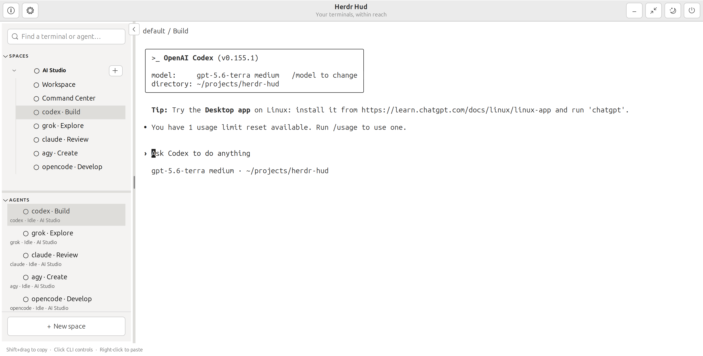

# Herdr Hud for Ubuntu

A native GTK/VTE companion for local Herdr terminals and agents on Ubuntu 26.04.

**A remix of Alex Finn’s version by [Alex Jax](https://github.com/alex-jax).**
Original: [Herdr HUD for Omarchy](https://github.com/finna/omarchy-herdr-hud).
This is an independently maintained Ubuntu implementation.

## Install

**[Step-by-step installation → install.md](install.md)** ·
**[Download the .deb preview](https://github.com/alex-jax/jax-herdr-hud/releases/tag/v0.1.2-preview.1)**

> **Important — finish setup with a logout/login:** After installing **Herdr** and
> **Herdr Hud**, open Hud's **gear/settings** and click **Enable floating H**.
> **Save your work, log out of Ubuntu, then log back in.** This lets GNOME load the
> H extension and connect it to Herdr Hud, which displays your Herdr terminals.
> Closing the app or locking the screen does not replace logging out.

Targets Ubuntu 26.04 / GNOME 50; tested on amd64 with Herdr 0.9.1.
The native `.deb` installs the app and optional floating H extension, and APT
resolves its system Python/GTK/VTE dependencies. Herdr and CLI agents are separate
installations. Source installation and modification instructions are also included.

This is an early public **development preview**, not a stable or App Center release.
The Snap recipe is included for the separate publishing effort; store approval and
full lifecycle validation remain pending. See [validation](docs/VALIDATION.md).

Features include separate Spaces/Agents lists, live status and notifications,
copy-on-selection, right-click paste, linked tab renaming, light/dark appearance,
and a draggable floating H with Ubuntu's accent colour.

## Screenshots

**Dark theme** — Spaces, Agents and the floating H.


**Light theme** — the same workspace in light mode.



## Use

Version 0.1.2 adds daily update checks, a download arrow linking to update
instructions, and one-click activation of the bundled floating H. It retains
the cold-start fix: the default `~` space and terminal open
automatically, before you add any additional spaces.

Browse Spaces and Agents, attach real terminals, add or rename spaces and terminals,
search, copy by dragging, and paste with right-click. Hide keeps monitoring;
Exit Hud disconnects only its clients. Explicit Close stops the targeted terminal
or space. The floating H is optional; the main window works independently.

The setup button locates Herdr automatically or lets you select its executable.
The H extension comes with the installer; click **Enable floating H** in setup
to turn it on. Complete first-time setup by logging out and back in once.
The About dialog contains version, publisher and original-project attribution.
A daily GitHub check shows a download arrow beside the information button when a
newer release is available; click it to open the GitHub update instructions.

## Documentation

- [Installation guide](install.md)
- [Contributing and building](CONTRIBUTING.md)
- [User manual](MANUAL.md)
- [Build and publishing guide](docs/PUBLISHING.md)
- [Optional H installation and GNOME submission](docs/GNOME_SUBMISSION.md)
- [Snap Store listing draft](docs/STORE_LISTING.md)
- [Classic confinement request draft](docs/CLASSIC_REQUEST.md)
- [Coding agent guidance](AGENTS.md)

## Source installation

The source installer remains available. It requires system Python 3, PyGObject,
GTK 3 and VTE 2.91 (`python3-gi`, `gir1.2-gtk-3.0`, `gir1.2-vte-2.91`).

```sh
python3 install.py
python3 enable.py
~/.local/bin/herdr-hud
```

Unlike the snap, this development installer creates a per-user login autostart
entry and copies the extension. `enable.py` disables the legacy `herdr-hud@local`
UUID before enabling the new one. Log out/in after updating loaded extension code.
Do not run the old and new extensions together. Existing preferences are retained.

## Development checks

```sh
python3 -m unittest discover -s tests -v
dbus-run-session -- python3 tests/smoke_setup.py
dbus-run-session -- python3 tests/smoke_sidebar.py
dbus-run-session -- python3 tests/smoke_desktop.py
dbus-run-session -- python3 tests/smoke_extension.py
```

GTK tests require a display; the extension test starts a separate headless GNOME
session. Test output goes to temporary directories or `HUD_TEST_OUTPUT`.
See the publishing guide for testing with the bundled runtime.
